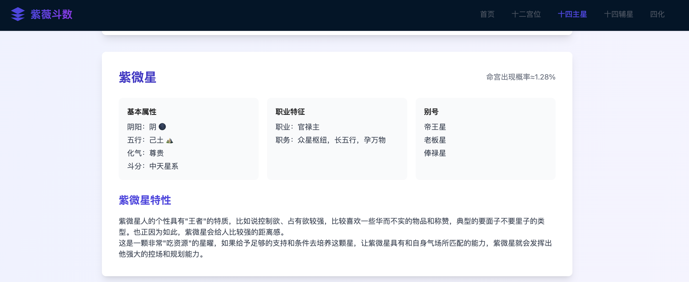

# 紫微斗数 - 探索东方古老的智慧

主页：https://wuhaohao1234.github.io/ziwei-pub/#/

## 项目介绍

这是一个基于 Vue 3 + Tauri + Vite 构建的紫微斗数学习和查询平台。本项目旨在以现代化的方式展示和传承这门古老的东方智慧。




### 主要功能

- 🌟 十四主星详解
- 🎯 十四辅星解析
- 🏰 十二宫位系统
- ⚡ 四化星详解
- 📱 支持桌面端和移动端

### 技术栈

- 前端框架：Vue 3
- 构建工具：Vite
- 跨平台框架：Tauri 2.0
- UI 组件：Ant Design Vue
- 样式工具：TailwindCSS
- 路由管理：Vue Router
- HTTP 客户端：Axios

## 快速开始

### 环境要求

- Node.js >= 16
- Rust >= 1.70
- pnpm >= 8.0

### 安装依赖

```bash
# 安装前端依赖
pnpm install

# 安装 Rust 依赖
cd src-tauri
cargo build
```

### 开发命令

```bash
# 开发模式
pnpm dev

# 构建 Web 版本
pnpm build

# 构建 Mac 版本
pnpm build:mac

# 构建 iOS 版本（需要 Apple 开发者账号）
pnpm ios:build
```

## 项目结构

```
├── src/                # 前端源码
│   ├── views/         # 页面组件
│   ├── router/        # 路由配置
│   ├── assets/        # 静态资源
│   └── App.vue        # 根组件
├── src-tauri/         # Tauri 相关代码
│   ├── src/           # Rust 源码
│   └── icons/         # 应用图标
├── public/            # 公共资源
└── docs/             # 文档
```

## 功能模块

### 十四主星
- 完整的十四主星解析
- 详细的性格特征描述
- 现代化解读与应用

### 十四辅星
- 辅星基本特质
- 与主星的互动关系
- 实际案例分析

### 十二宫位
- 宫位基本含义
- 宫位组合解析
- 现代生活应用

### 四化系统
- 四化基本原理
- 四化组合效果
- 实战参考指南

## 贡献指南

欢迎提交 Issue 和 Pull Request。在提交 PR 之前，请确保：

1. 代码风格符合项目规范
2. 添加必要的测试用例
3. 更新相关文档

## 版权说明

本项目采用 MIT 许可证，详见 [LICENSE](LICENSE) 文件。

## 联系方式

- 项目主页：[GitHub](https://github.com/yourusername/ziwei-pub)
- 问题反馈：[Issues](https://github.com/yourusername/ziwei-pub/issues)

## 致谢

感谢所有为本项目做出贡献的开发者，以及提供参考资料的紫微斗数研究者。

## 更新日志

### v0.1.0 (2024-03)
- 🎉 项目初始化
- ✨ 实现基础功能
- 🌈 完成界面设计
- 📱 支持多端适配
